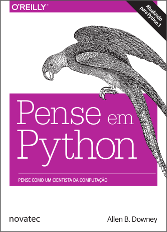

# Exercícios do livro: [Pense em Python - 2° Edição](https://penseallen.github.io/PensePython2e/) :book:

Esse repositório tem como objetivo armazenar os exercícios realizados durante a leitura do livro. 

O livro ensina programação para quem nunca programou, usando Python 3 nos exemplos. É aplicado no Olin College, IBMEC e outras faculdades de engenharia excelentes.
